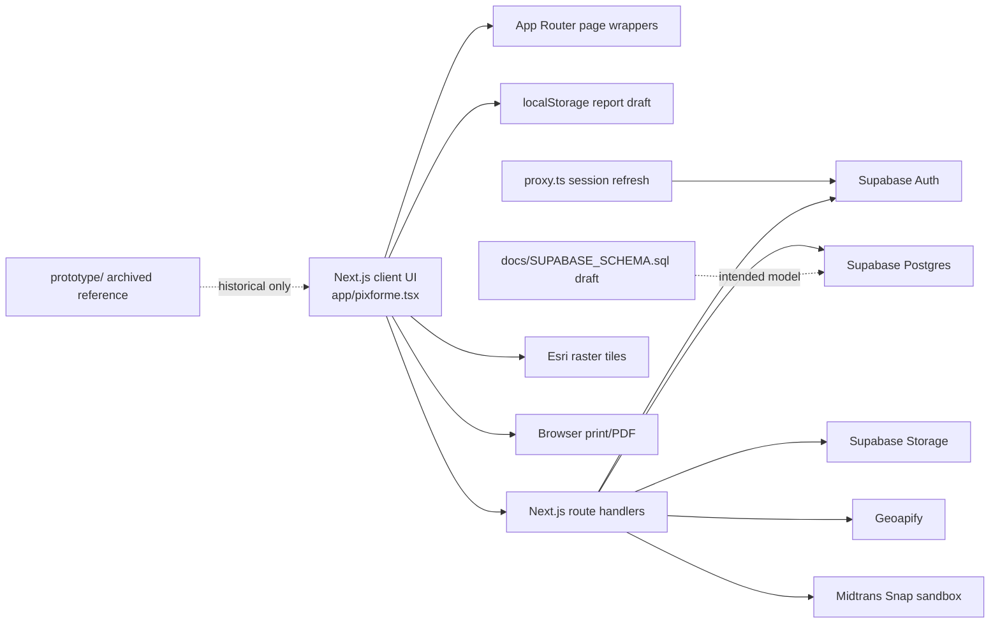

# Pixforme Codebase Baseline

Status: Baseline captured 2026-07-15 from commit `bda47fd`; no runtime behavior changed.

## Product flow

Pixforme is a browser-based construction documentation tool. The current path is public landing/pricing -> email/password auth -> one user-owned workspace -> project selection -> a four-step wizard (project settings, report details, photos/captions/geotags, preview/export). `app/pixforme.tsx` implements nearly every UI surface and stores the working report draft under `pixforme.prototype.wizard.v3` in browser `localStorage`. Supabase currently persists identity, profiles, workspace/project metadata, uploaded photo metadata, and credit history reads; report authoring tables exist only in the SQL draft and are not used by the UI.

## Technology

| Layer | Current implementation | Evidence |
|---|---|---|
| Web | Next.js 16.1.6 App Router, React 19.2.4, TypeScript strict | `package.json`, `tsconfig.json`, `app/` |
| UI | One client module plus global CSS | `app/pixforme.tsx`, `app/globals.css` |
| Auth/data/storage | Supabase SSR/browser clients; service-role server client | `lib/supabase/*`, `app/api/*` |
| Validation | Zod for password auth payloads | `lib/auth/password.ts` |
| Maps | Esri World Imagery tiles and server-side Geoapify geocoding | `lib/maps.ts`, `app/api/maps/*` |
| Payment | Midtrans Snap sandbox token route; incomplete notification route | `app/api/midtrans/*` |
| Report export | Browser print dialog with dynamic `@page` CSS | `WizardStep4Page` in `app/pixforme.tsx` |
| Prototype | Archived HTML/CSS/JS design experiments | `prototype/` |

No test runner, CI workflow, migration directory, background worker, or production PDF renderer is present.

## Routes

| Route | Type | Current responsibility |
|---|---|---|
| `/` | page | Landing page |
| `/product.html`, `/tools.html`, `/pricing.html` | pages | Marketing and sandbox purchase entry |
| `/login.html`, `/signup.html`, `/kredit.html` | pages | Password auth and credit history UI |
| `/workspace.html` | protected page | Load/create/select Supabase projects |
| `/wizard-step1.html` ... `/wizard-step4.html` | protected pages | Local draft authoring and browser-print export |
| `/map-test.html` | page | Map integration test surface |
| `/auth/callback` | route | Exchange auth code and upsert profile |
| `/auth/sign-out` | POST route | Sign out and redirect |
| `/api/auth/me`, `/api/auth/password` | API | Session profile, login, signup |
| `/api/workspace`, `/api/workspace/projects` | API | Current workspace and project CRUD |
| `/api/storage/upload`, `/api/storage/photos` | API | Service-role backed storage upload/list |
| `/api/maps/config`, `/api/maps/geocode` | API | Map config, forward/reverse geocode |
| `/api/credits` | API | Balance and ledger reads |
| `/api/midtrans/config`, `/api/midtrans/snap-token`, `/api/midtrans/notification` | API | Sandbox client key, token creation, placeholder webhook |

## Persistence

- Supabase Auth owns credentials and sessions.
- `profiles`, `workspaces`, and `projects` are called by production routes.
- `gallery_photos` is written after a private report-photo upload; storage fallback listing supports older objects.
- `ai_credit_ledger` is read-only from the user API.
- `reports`, `report_photos`, geotags, preview settings, exports, AI jobs, orders, and webhook events are described in `docs/SUPABASE_SCHEMA.sql` but are not wired end to end.
- The active report, photo ordering/captions/geotags, and preview settings remain in browser `localStorage`.
- `docs/SUPABASE_SCHEMA.sql` is an apply-by-hand draft, not migration history. `lib/supabase/database.types.ts` is handwritten and omits `report_exports`.

## External integrations

- Supabase Auth, Postgres, and Storage.
- Esri public raster imagery and Geoapify geocoding.
- Midtrans Snap sandbox.
- OpenRouter appears only in environment placeholders; no AI route/provider call exists.
- Remote `picsum.photos` images remain in marketing/prototype visuals.

## Prototype versus production

Next.js under `app/` is the application source of truth. `prototype/` is historical reference only. It has independent localStorage state, a standalone Midtrans test server, and a user-modified `wizard-step4.html`; changes there do not automatically change production. Existing prototype-focused documents contain stale Next.js delta statements and must not outrank runtime code.

## Strengths

- Current dependencies include patched Next.js/React versions.
- Server routes call `supabase.auth.getUser()` and most workspace/photo queries are owner-scoped.
- Private photo objects use owner-prefixed paths and signed URLs.
- Auth input validation and password rules are explicit.
- Report preview already supports five templates, A4/F4, pagination, geotag overlays, and print sizing.
- Composite owner foreign keys already protect workspace -> project -> report paths in part of the draft schema.

## Not production-ready

- `app/pixforme.tsx` is a 1,600+ line client boundary mixing public pages, auth, workspace, authoring, maps, and rendering.
- Report state is non-canonical localStorage and cannot support durable multi-device authoring.
- Homepage upload kinds are accepted for any authenticated user and use public buckets.
- File validation trusts declared MIME and client-supplied dimensions; no content signature, decode, checksum, or malware policy is enforced.
- Auth callback `next` is not allowlisted; the UI logout uses a GET anchor against a POST-only route.
- Proxy protection is optional and is not a sufficient authorization boundary by itself.
- Service role is used broadly for storage and photo metadata operations.
- Midtrans token creation is unauthenticated, sandbox-only, not persisted, and webhook handling only echoes payloads.
- Rate limits and reverse-geocode cache are per-process memory.
- Signed URLs live seven days with no explicit revocation/refresh contract.
- SQL relationships do not consistently bind `owner_id` across geotags/settings/exports/AI references.
- Browser print output has no immutable snapshot, deterministic renderer, or golden test.
- No automated tests or CI quality gates exist.

## High-level dependency diagram

## Baseline limitations

This baseline is a static repository assessment. It does not assert that the draft SQL has been applied to any live Supabase project or that provider credentials and webhooks are production-ready.
